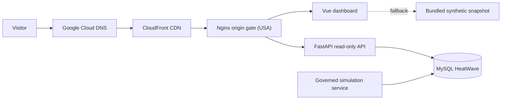
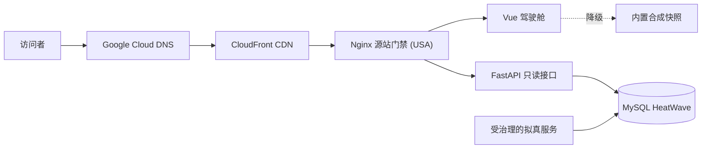

<div align="center">
  <h1>MOD</h1>
  <p><strong>Real-time Command Cockpit & Digital Twin for Enterprise System Rollout</strong></p>
  <p>
    A decision-ready, high-density command center powered by Vue 3, ECharts, FastAPI, MySQL HeatWave AutoML, and live event simulation.
  </p>

  <p>
    <a href="https://github.com/7893/mod/actions/workflows/quality.yml"></a>
    <a href="https://mod.fuming.name/"></a>
    <a href="LICENSE"></a>
    
    
    
    
  </p>

  <p>
    <a href="https://mod.fuming.name/"><strong>Explore Live Cockpit »</strong></a>
    <br />
    <a href="#english">English</a> ·
    <a href="#简体中文">简体中文</a> ·
    <a href="docs/INDEX.md">Documentation</a> ·
    <a href="docs/CURRENT-STATE.md">Current State</a> ·
    <a href="docs/KNOWN-ISSUES.md">Known Issues</a>
  </p>
</div>

> [!IMPORTANT]
> MOD is a demonstration and engineering-research project. All organizations, people, transactions, and
> operational events shown by the system are fictional synthetic data.

<a id="english"></a>

## English

Updated: 2026-09-13 · Status: Active project overview<br>
Scope: Product positioning, architecture, development entry points, and repository navigation

### Overview

MOD turns a complex, multi-stage enterprise system rollout into a decision-ready visual command center.
It connects construction progress, rollout readiness, operational evidence, compliance signals, and risk
follow-up into one coherent management narrative instead of presenting a collection of disconnected metrics.

The project is designed for leaders and operators who need both an immediate overview and the ability to drill
down into the organizations, batches, stages, and evidence behind every conclusion.

### Six coordinated views

| View | Decision focus |
|---|---|
| **A · Overview** | Program health, rollout momentum, operating scale, and closure signals |
| **B · Construction** | Stage completion, task structure, training, readiness, and unit-level ledgers |
| **C · Rollout** | Batch progression, regional coverage, dual-run status, and deployment backlog |
| **D · Operations** | Documents, vouchers, integrations, trends, and data-quality evidence |
| **E · Compliance** | Compliance posture, supervision layers, batch comparison, and exceptions |
| **F · Risk & Intelligence** | Risk concentration, model quality, explainability, and daily decision briefings |

### What makes MOD different

- **Management-first storytelling** — every panel supports a decision, comparison, drill-down, or operational action.
- **High-fidelity synthetic operations** — a governed simulation engine produces internally consistent rollout,
  document, voucher, integration, training, and lifecycle events without using real business data.
- **Dense but readable visualization** — Vue and ECharts power a responsive six-screen cockpit with a 34-region map,
  coordinated filters, cross-panel navigation, and a shared visual contract.
- **Analytics with evidence** — MySQL HeatWave supports large-scale aggregation, in-memory acceleration, AutoML
  scoring, and explainability while the UI distinguishes measured facts from unavailable data.
- **Resilient presentation** — bundled fallback snapshots and read-only live projection keep the dashboard useful
  during backend refreshes or data-source interruptions.
- **Auditable AI-assisted engineering** — repository rules, signed commits, CI gates, regression tests, ADRs, known
  issues, and document-preservation checks keep human decisions and AI implementation traceable.

### Architecture



Standard production delivery runs through GitHub Actions CI/CD upon push to `main` with full quality gates, with
atomic release symlinks on the dedicated USA production host and unified service management under `mod.service`.
Source edits and local builds do not become a production release automatically. Runtime credentials remain outside Git.

### Technology

| Layer | Main technologies |
|---|---|
| Frontend | Vue 3, TypeScript, Pinia, ECharts, Tailwind CSS, Vite |
| Backend | FastAPI, Python 3.12+, SQLAlchemy, Uvicorn |
| Data and analytics | MySQL HeatWave, HeatWave AutoML |
| Quality | Pytest, Vitest, Ruff, vue-tsc, repository governance checks |
| Delivery | Nginx, systemd, atomic release symlinks, GitHub Actions |

### Local development

Prerequisites: Python 3.12+, [`uv`](https://docs.astral.sh/uv/), Node.js, pnpm, and Make.

```bash
# Terminal 1 — API
cd backend
uv sync --all-extras
uv run uvicorn app.main:app --host 127.0.0.1 --port 8100

# Terminal 2 — dashboard
cd frontend
pnpm install
pnpm dev
# http://127.0.0.1:4173/
```

The dashboard includes a synthetic fallback snapshot. Database-backed runtime features require local environment
configuration managed outside the repository.

Run the complete quality gate before committing:

```bash
make check
```

### Repository guide

| Entry | Purpose |
|---|---|
| [AGENTS.md](AGENTS.md) | Mandatory repository rules for people and coding agents |
| [ENFORCEMENT.md](ENFORCEMENT.md) | Action-time safety and consistency gates |
| [CONTRIBUTING.md](CONTRIBUTING.md) | Development, validation, documentation, and commit workflow |
| [Current state](docs/CURRENT-STATE.md) | Canonical source for current runtime and architecture facts |
| [Documentation index](docs/INDEX.md) | Maintained standards, operations, decisions, evidence, and history |
| [Known issues](docs/KNOWN-ISSUES.md) | Defect and technical-debt board with detailed KI records |
| [Changelog](CHANGELOG.md) | Generated release history from the verified Git baseline |

Feature requests and planned work belong in internal repository tasks. Confirmed defects and technical debt are tracked on the
repository's known-issues board (GitHub Issues are permanently disabled per [ADR-0014](docs/decisions/0014-停用GitHub-Issues统一使用本地KI问题跟踪体系.md)).

### License

MOD is available under the [MIT License](LICENSE).

---

<a id="简体中文"></a>

## 简体中文

更新日期：2026-09-13 · 状态：现行项目概览<br>
适用范围：产品定位、运行架构、开发入口与仓库导航

> [!IMPORTANT]
> MOD 是用于演示和工程研究的项目。系统展示的组织、人员、交易与运行事件全部是虚构的合成数据。

### 项目概述

MOD 将复杂、多阶段的业务系统建设推广过程，转化为一套面向决策的可视化指挥驾驶舱。它把建设进度、
上线准备、运营佐证、合规信号和风险闭环连接成一条完整管理主线，而不是简单堆放彼此割裂的指标。

项目面向需要快速掌握全局、同时会主动下钻核验的管理者与运营人员。每项结论都可以继续追溯到相关单位、
批次、建设阶段和业务证据。

### 六屏协同视图

| 屏幕 | 决策重点 |
|---|---|
| **A · 项目总览** | 项目健康度、推广节奏、运营规模与风险闭环 |
| **B · 建设进度** | 阶段完成度、任务结构、培训、数据准备与单位台账 |
| **C · 上线推广** | 批次推进、区域覆盖、双轨状态与上线积压 |
| **D · 业务运营** | 单据、凭证、接口集成、运行趋势与数据质量证据 |
| **E · 合规监督** | 合规态势、监督分层、批次比较与异常情况 |
| **F · 风险与智能研判** | 风险集中度、模型质量、可解释性与每日决策简报 |

### MOD 的核心特点

- **围绕管理决策组织叙事**：每个面板都服务于决策、比较、下钻或后续行动。
- **高仿真合成业务运行**：受治理的拟真引擎持续生成相互勾稽的建设、单据、凭证、接口、培训和生命周期
  事件，全程不使用真实业务数据。
- **高密度但可读的可视化**：Vue 与 ECharts 构成响应式六屏驾驶舱，支持 34 省级区域地图、联动筛选、
  跨面板跳转和统一视觉契约。
- **有证据的分析能力**：MySQL HeatWave 承担大规模聚合、内存加速、AutoML 评分与模型解释；界面严格区分
  已测量事实、零值和暂未提供的数据。
- **稳定的展示体验**：内置降级快照与只读实时投影，使后端刷新或数据源短暂异常时仍能持续展示。
- **可审计的 AI 协作工程**：仓库规则、签名提交、CI 闸门、回归测试、ADR、KI 和文档保全检查，让人的决策
  与 AI 的实现都有迹可循。

### 运行架构



标准生产发布通过 GitHub Actions CI/CD 流水线（push 至 `main` 分支自动触发完整质量门禁、前端构建与生产机原子软链部署），
配合轻量守护 `mod.service` 统一托管。修改源码或执行本地构建不会自动形成生产发布；运行凭据始终保留在 Git 仓库之外。

### 技术栈

| 层级 | 主要技术 |
|---|---|
| 前端 | Vue 3、TypeScript、Pinia、ECharts、Tailwind CSS、Vite |
| 后端 | FastAPI、Python 3.12+、SQLAlchemy、Uvicorn |
| 数据与分析 | MySQL HeatWave、HeatWave AutoML |
| 质量保障 | Pytest、Vitest、Ruff、vue-tsc、仓库治理检查 |
| 交付运行 | Nginx、systemd、原子发布软链、GitHub Actions |

### 本地开发

前置条件：Python 3.12+、[`uv`](https://docs.astral.sh/uv/)、Node.js、pnpm 和 Make。

```bash
# 终端 1——后端接口
cd backend
uv sync --all-extras
uv run uvicorn app.main:app --host 127.0.0.1 --port 8100

# 终端 2——前端驾驶舱
cd frontend
pnpm install
pnpm dev
# http://127.0.0.1:4173/
```

驾驶舱自带合成数据降级快照。需要访问数据库的运行能力必须使用仓库外管理的本地环境配置。

提交前运行完整质量闸门：

```bash
make check
```

### 仓库导航

| 入口 | 用途 |
|---|---|
| [AGENTS.md](AGENTS.md) | 所有人和编码 Agent 必须遵守的仓库硬约束 |
| [ENFORCEMENT.md](ENFORCEMENT.md) | 在动作发生时生效的安全与一致性闸门 |
| [CONTRIBUTING.md](CONTRIBUTING.md) | 开发、验证、文档和提交流程 |
| [当前状态](docs/CURRENT-STATE.md) | 当前运行与架构事实的唯一权威入口 |
| [文档索引](docs/INDEX.md) | 现行规范、运维、决策、证据与历史资料入口 |
| [已知问题](docs/KNOWN-ISSUES.md) | 缺陷与技术债务看板，以及各 KI 详情 |
| [变更记录](CHANGELOG.md) | 从已核验 Git 基线生成的发布历史 |

本项目彻底停用 GitHub Issues（详见 [ADR-0014](docs/decisions/0014-停用GitHub-Issues统一使用本地KI问题跟踪体系.md)）。需求、任务与已确认缺陷统一在仓内任务与已知问题看板中闭环跟踪。

### 开源许可

MOD 使用 [MIT License](LICENSE)。
