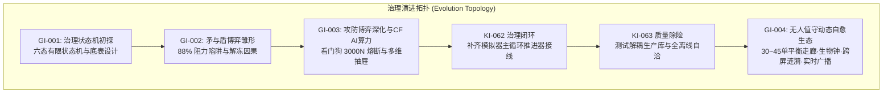
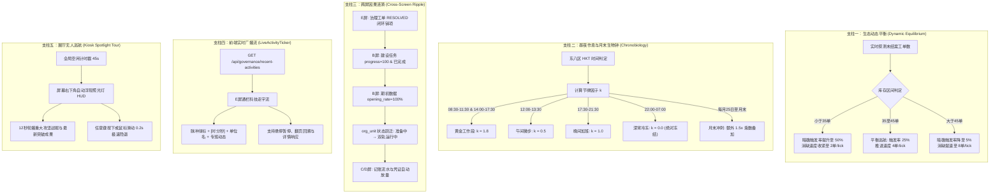
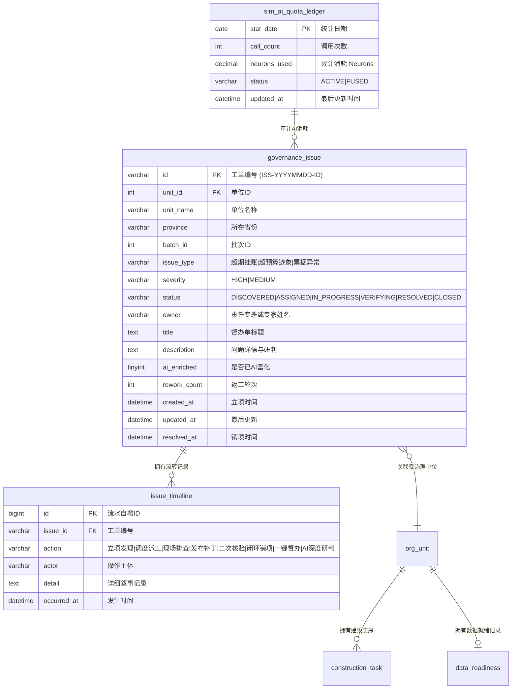

# 合规治理因果模拟与动态自愈生态系统架构演进总纲

更新日期：2026-09-09
状态：现行
适用范围：GI-001/GI-002/GI-003/GI-004 演进链路、KI-062/KI-063 缺陷闭环、矛与盾动力学、AI配额看门狗与跨屏因果涟漪架构；含 KI/GI 编号体系与 GitHub Issue 权威映射（见第一章）

---

## 一、背景与演进全景 (Background & Evolution Spectrum)

在大规模数字化转型与业财一体化推进的大盘中，展厅大屏与指挥看板往往面临“两极分化”的严重失真困境：
- **静态死水（Static Illusion）**：数据缺乏时间维度与业务逻辑推动，大屏指标恒定全绿或一成不变，丧失了企业正在生产运营的生命力；
- **机械虚构（Synthetic Fiction）**：通过随机数或无业务因果的假脚本制造虚假波动，不仅无法禁受审计与专业人员推敲，且一旦发生数据穿透必然导致逻辑破绽。

为彻底破除上述痛点，项目自 GI-001 起历经四代重要演进与两次严苛缺陷治理，构建了一套**基于真实企业组织阵列、业务阻力暗礁与闭环自愈动力学**的高保真实时仿真指挥大盘。

### 编号体系与 GitHub Issue 映射（KI / GI 关系厘清）

本项目对问题按性质分两条轨道管理，两者职责不混（详见 [AGENTS.md](../../AGENTS.md) 四铁律与
[文档生命周期规范](DOCUMENTATION-LIFECYCLE.md)）：

- **KI（Known Issue）· 记录在本地仓库**：已发现的缺陷、数据漂移与现有技术债。看板 `docs/KNOWN-ISSUES.md`，
  详情 `docs/issues/KI-xxx.md`，状态 `DRAFT`/`OPEN`/`IN-PROGRESS`/`DONE`，随修复代码同一提交演进，受文档治理闸门强制。
- **GI（GitHub Issue）· 记录在 GitHub 线上**：新功能、新能力与计划任务（enhancement），入口
  [github.com/7893/mod/issues](https://github.com/7893/mod/issues)，模板见 `.github/ISSUE_TEMPLATE/`。

**"GI-00x" 是本文对治理仿真「演进代际」的叙事编号，与 GitHub Issue 的真实编号 `#N` 不是逐一对应关系。**
为避免混淆，下表是唯一权威映射，凡文档中出现 "GI-00x" 均以此表指代的 GitHub Issue 与实现状态为准：

| 文档演进代际 | 对应 GitHub Issue | 线上状态 | 核心内容 | 落地承载 |
|---|---|---|---|---|
| GI-001 | 归入 [#3](https://github.com/7893/mod/issues/3)（E/F 屏盘活总 issue 的阶段一叙述） | closed（completed，已回写关闭） | 治理全生命周期六态状态机与 `governance_issue`/`issue_timeline` 底表 | `simulation/governance_state_machine.py` |
| GI-002 | 归入 [#3](https://github.com/7893/mod/issues/3)（阶段二叙述），因果推进关联 [#2](https://github.com/7893/mod/issues/2) | closed（completed，已回写关闭） | 矛与盾博弈雏形：88% 阻力位卡点与解冻因果 | `simulation/construction_propeller.py` |
| GI-003 | 归入 [#3](https://github.com/7893/mod/issues/3)（阶段三叙述） | closed（completed，已回写关闭） | 攻防博弈深化 + Cloudflare Workers AI 挂接、3000N 配额看门狗与 E/F 屏多维抽屉 | `simulation/quota_watchdog.py`、`simulation/cf_ai_client.py`、`ComplianceInspectDrawer.vue`、`AiQuotaCapsule.vue` |
| GI-004 | [#4](https://github.com/7893/mod/issues/4)（编号对齐，标题含 GI-004） | **closed** | 无人值守动态自愈生态：30~45 单平衡走廊、东八区生物钟、跨屏涟漪、实时广播、展厅巡航 | `simulation/construction_propeller.py`、`governance_state_machine.py`、`LiveActivityTicker.vue`、`KioskSpotlightTour.vue` |

另有两个 GitHub Issue 承载对应能力，与上表交织：

| GitHub Issue | 线上状态 | 核心内容 | 关联 |
|---|---|---|---|
| [#1](https://github.com/7893/mod/issues/1) | closed（completed，已回写关闭） | 风险与问题生命周期闭环（分派-处置-销项时间线） | 由 GI-001 状态机与 GI-003 的 E 屏抽屉共同实现 |
| [#2](https://github.com/7893/mod/issues/2) | closed（completed，已回写关闭） | 模拟引擎驱动单位建设推进与风险自愈动态 | 由 [KI-062](../issues/KI-062-治理自愈推进器已就位但未接入模拟主循环而静默失效.md) 接线闭环 + GI-002/GI-004 推进器实现 |

> 说明：GitHub `#1`/`#2`/`#3`/`#4` 的核心能力均已随 GI-003/GI-004 与 KI-062 实现并部署（生产发布 `20260909-095536`），
> 四个 issue 均已以 `completed` 回写关闭说明并关闭；本编号口径的长期一致性治理由 [KI-064](../issues/KI-064-GI编号口径与GitHub-Issue状态不一致.md) 跟踪。

### 演进与改进过程记录（时间线）

| 阶段 | 时间 | 事件 |
|---|---|---|
| GI-001 | — | 设计六态治理状态机与 `governance_issue`/`issue_timeline` 底表，引入容量 8 的专家专班调度池 |
| GI-002 | — | 引入矛与盾因果博弈雏形：冲刺批次推进至 80~90% 时按概率撞上"合规暗礁"，钳位 88% 并生成待整改工单 |
| GI-003 | — | 攻防博弈深化并挂接 Cloudflare Workers AI，落地 3000N/日配额看门狗（超额 FUSED 熔断）、离线叙事库双保险与 E/F 屏多维交互抽屉 |
| KI-062 | 2026-09-09 | 修复"推进器已实现但未接入模拟主循环而静默失效"：在慢电影建设周期装配推进器与滴灌回填，受 `MOD_SIMULATION_ENGINE_ENABLED` 失败关闭门禁守护 |
| KI-063 | 2026-09-09 | 除险 KI-062 回归测试的生产库直连与硬编码内网凭据，重构为纯内存 Mock、100% 离线自洽 |
| GI-004 | 2026-09-09 | 无人值守动态自愈生态落地（GitHub #4 已 closed）：动态平衡走廊、东八区生物钟、跨屏因果涟漪、实时广播与展厅巡航 |
| 部署 | 2026-09-09 | 上述能力随生产发布 `20260909-095536` 上线，健康探针全绿 |

---

## 二、核心问题集与治理闭环全记录 (The Problem Spectrum & Closed-Loop Remediation)

本体系由以下核心议题与缺陷修复交织推进、螺旋上升：

### 1. GI-001：治理全生命周期状态机与存量工单底表
- **核心挑战**：原系统缺乏针对推进卡阻、数据质量异常与平账偏差的显式追踪实体。
- **架构解法**：
  - 设计六态有限状态机：`DISCOVERED`（立项发现）$\to$ `ASSIGNED`（调度派工）$\to$ `IN_PROGRESS`（现场排查）$\to$ `VERIFYING`（发布补丁/核验中）$\to$ `RESOLVED`（闭环销项）$\to$ `CLOSED`（归档关闭）。
  - 创建规范数据底表：`governance_issue`（工单主表）与 `issue_timeline`（流水轨迹表）。
  - 引入容量为 8 的集团督导专班专家池（`ExpertPool`），模拟真实世界中资源紧缺时的排队等待机制。

### 2. GI-002：矛与盾因果博弈雏形（88% 阻力位机制）
- **核心挑战**：以往单位推进直接单调递增至 100%，严重违背大型央企系统上线中“越到终点阻力越密集”的客观事实。
- **架构解法**：
  - **矛（ConstructionPropeller）**：第七/八批次冲刺单位推进至 80%~90% 区间时，以一定概率撞上“合规暗礁”（如期初往来跨期挂账、双轨入账汇率尾差、ERP接口超时）。
  - **盾（GovernanceStateMachine）**：暗礁一旦触发，立即锁定对应单位进度（钳位在 88%），同时在 E 屏生成待整改工单，由专家专班介入处置；工单销项前单位无法向前推进。

### 3. GI-003：矛与盾攻防博弈深化与 Cloudflare Workers AI 安全挂接
- **核心挑战**：单靠模板叙事容易千篇一律，但直接调用商业大模型面临高额 Token 账单与外部依赖故障风险。
- **架构解法**：
  - **$0.00 零费用硬防护**：挂接 Cloudflare Workers AI 免费额度，每日设置 3,000 Neurons 硬限制看门狗（`QuotaWatchdog`），日级流水记录于 `sim_ai_quota_ledger`，超额瞬时熔断（FUSED）。
  - **离线降级双保险**：内置五大行业（煤炭开采、电力能源、化工新材、高端装备、现代金融）高拟真叙事库（`LocalNarrativeLibrary`），网络异常或熔断时零等待无感降级。
  - **前端交互闭环**：E 屏落地 `ComplianceInspectDrawer.vue`（六态 Stepper、专班展示、一键督办上帝之手），F 屏落地 `AiQuotaCapsule.vue`（实时算力监控胶囊）。

### 4. KI-062：推进器组件存在但未接入主循环静默失效
- **缺陷现象**：`ConstructionPropeller` 与 `TrickleBackfiller` 代码虽已实现，但未在模拟器主循环 `simulation/runtime_service.py` 的慢电影建设周期中调用，导致模拟器运行时治理状态完全静止。
- **根本原因**：代码落地时缺少端到端装配验收，技术债务遗留在主调度线程外。
- **修复措施**：在 `SimulatorRuntimeService._step_slow_movie_cycle` 中正式装配推进器与滴灌回填器，并受 `MOD_SIMULATION_ENGINE_ENABLED` 失败关闭门禁守护。

### 5. KI-063：KI-062 回归测试直连生产库且硬编码内网凭据
- **缺陷现象**：KI-062 随附的自动化回归测试试图连接真实内网 MySQL 数据库（`10.0.1.25`）并执行 `commit()`，源码中残留硬编码账号口令。
- **违反红线**：严重违背 `ENFORCEMENT.md` 闸门 A（凭据零容忍）与闸门 B（单测必须完全离线自洽）。
- **修复措施**：重构测试体系，全面替换为纯内存 `MockLedgerConnection` 与虚拟游标；移除所有内网 IP 与默认凭据，使用严格只读的环境变量读取与安全占位符；回归测试套件实现 100% 离线自洽且毫秒级响应。

### 6. GI-004：无人值守动态自愈生态与全景大屏多维交互演进（[GitHub Issue #4](https://github.com/7893/mod/issues/4)）
- **核心挑战**：若存量工单只消缺不生成，长期挂机后大屏终将因工单清零而变为“全绿死水”；夜间非工作时段产生虚假流转；且远距离观摩缺乏视觉脉搏。
- **架构解法**：落地五大支柱（动态平衡走廊、东八区昼夜节律、跨屏因果涟漪、实时广播流、展厅巡航模式），实现真正有机演进的生命体。
- **闭环成果**：全量代码与测试已合入 `main`（Commit `27b9659`），Issue #4 已正式验收关闭。

---

## 三、五大核心架构设计支柱 (Five Architectural Pillars)

### 1. 生态动态平衡走廊（30~45 单呼吸带）
为了使大屏在**长达数周、无人值守**的展厅运行中保持逼真与活力，推进器内置动态调节算法：
- 每周期探测 `SELECT COUNT(*) FROM governance_issue WHERE status != 'RESOLVED'`；
- 若低于 35 单：系统自动判定为“治理成效显著但需防范松懈”，将第七/八批及蓄水池单位冲刺时的暗礁触发率提升至 50%，伴生出新的合理瑕疵；
- 若高于 45 单：系统判定为“专班攻坚压力过大”，将暗礁触发率压低至 5%，集中全力提速销项；
- **成效**：工单存量永久在 30~45 单区间平滑呼吸，既展示强大的合规整改能力，又体现超大型企业日常治理的长期性与复杂性。

### 2. 东八区昼夜作息与日历生物钟
现实中的企业专班绝不可能在凌晨 3 点出具现场审计报告或审批整改报告。为此系统引入东八区（Asia/Shanghai）生物钟算子 $k_{\text{rhythm}}$：
- **深宵冻结（22:00 - 07:00）**：$k = 0.0$。状态机强力阻断状态向前跃迁，绝不出具虚假通报；
- **黄金工段（08:30 - 11:30, 14:00 - 17:30）**：$k = 1.8$。专班集中开会、整改、提交验收，流转频率最活跃；
- **午休平缓（12:00 - 13:30）**：$k = 0.5$。微幅流动；
- **晚间维护（17:30 - 21:30）**：$k = 1.0$。稳态流转；
- **月末决战（每月 25 日起至月底）**：叠加 $1.5$ 冲刺系数（最高 $3.0$），返工率自适应下降至 8%，模拟大型央国企月末清账封账的攻坚态势。

### 3. 全盘跨屏因果涟漪网络
E 屏的治理消缺并非孤立的文字记录，而是牵一发而动全身的因果源头：
- **消缺解冻**：工单销项触发 `_boost_healed_unit`，对应单位所有卡顿在 88% 的 `construction_task` 进度直冲 100%，状态变更为 `'已完成'`；
- **就绪达标**：`data_readiness.opening_rate` 提升至 `'100.0%'`，状态变更为 `'校验通过'`；
- **状态跃迁**：若单位此前处于 `'准备中'` 或 `'已具备双轨条件'`，自动跃迁为 `'双轨运行中'`；
- **记账放量**：模拟器捕获到新增的在线双轨单位，自动将其纳入下游凭证记账池，C/D 屏的总账流水与凭证体量同步增长，形成完美的因果自洽。

### 4. 展厅视觉脉搏（实时走字广播流）
远距离（3~5 米外）观摩大屏时，静态文字不易被察觉：
- E 屏顶端挂载暗黑科技玻璃拟态组件 `LiveActivityTicker.vue`；
- 后端轻量级提供 `GET /api/governance/recent-activities`（毫秒级响应）；
- 前端以翡翠绿雷达呼吸灯配合平滑淡入淡出动效，每 6 秒轮播一条专班实时排查与消缺流水，直观传递“后台系统正在一刻不停地自动排查与自愈”。

### 5. 展厅无人值守聚光灯巡航
- `KioskSpotlightTour.vue` 监听全局鼠标与键盘活动；
- 若观众离开或空闲超过 45 秒，屏幕右下角自动唤起沉浸式悬浮 HUD 卡片；
- 每 12 秒智能轮播高戏剧性的典型攻坚单位（如驻点现场排查、历史分录平账销项、跨期税率智能打补丁）；
- 观众重新触碰鼠标或按键，卡片在 0.2 秒内极速隐退，瞬间交还操控权。

---

## 四、数据模型与字段契约 (Data Contracts)

---

## 五、质量闸门与安全合规防线 (Quality Gates & Compliance Standard)

本项目在工程实施中全面执行以下防线约束：

1. **凭据零容忍（ENFORCEMENT 闸门 A）**：
   - 杜绝在任何源码、脚本或测试文件中出现明文内网 IP、口令或 Token 默认值；
   - 本地与 CI `scan_secrets.py` 扫描暂存区改动，发现疑似凭据立即以非零状态阻断提交。

2. **单测 100% 离线自洽（ENFORCEMENT 闸门 B）**：
   - 依据 KI-063 治理教训，所有单元测试与集成测试严禁直连外部生产库或公网；
   - 依赖注入采用纯内存 Mock 连接或只读 fixture，229 项后端 pytest 测试在 3.3 秒内全绿通过，22 个前端 Vitest 测试套件在 8 秒内全绿通过。

3. **零费用硬防护承诺**：
   - AI 算力看门狗（`QuotaWatchdog`）设立每日 3,000 Neurons 硬熔断阈值；
   - 异常、离线或超额时自动无感降级至内置本地叙事库，严守 $0.00 账单红线。

4. **状态与文档同行同步（四铁律）**：
   - 任何涉及核心行为的变更，必须在同一 commit 中同步更新 `docs/CURRENT-STATE.md`；
   - 质量门禁 `python3 scripts/project/check_doc_sync.py` 与 `check_document_governance.py` 自动化核验，保障代码事实与文档事实高度同构。
