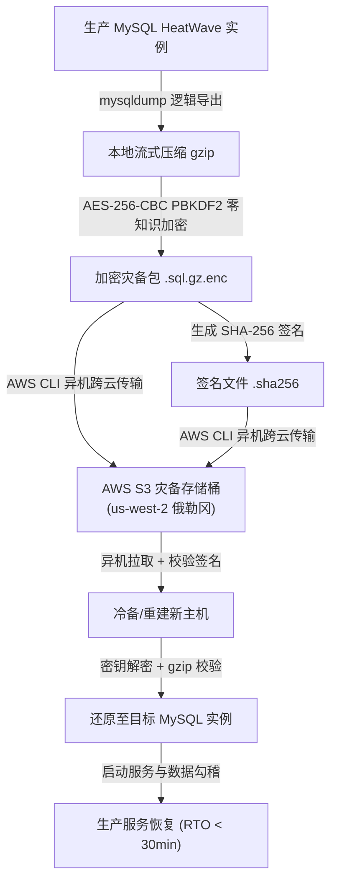

# MOD 灾难恢复与数据还原操作手册 (Disaster Recovery Runbook)

- 文档版本：v1.0.0
- 更新日期：2026-09-08
- 适用范围：生产主机故障、云服务商租户级故障、数据库损坏或勒索攻击下的全量灾难恢复
- 关联问题：[KI-042 灾难恢复能力不足与异机加密备份缺失](../issues/KI-042-灾难恢复能力不足与异机加密备份缺失.md)、[数据与安全标准](../development/DATA-AND-SECURITY-STANDARD.md)

---

## 1. 灾难恢复架构与指标



### 恢复指标 (SLA)
- **RPO (Recovery Point Objective)**：$\le 24$ 小时（每日凌晨 03:00 HKT 离峰定时全量增量归档）。
- **RTO (Recovery Time Objective)**：$\le 30$ 分钟（从全新裸机到数据库还原及应用完全上线）。
- **灾备目标地**：AWS S3 专用存储桶 `s3://mod-backup-015590450538/backups/`（位于美国俄勒冈 `us-west-2`，跨大洲、跨云厂商物理隔离，开启默认 SSE-AES256 加密与公网阻断）。

---

## 2. 灾难场景应急响应流程

### 场景 A：云服务商租户/主机全面灭失（物理机损坏或账号冻结）

#### 第 1 步：准备新运行主机与依赖工具
在新机器（Ubuntu 24.04+ 或任意 Linux 发行版）上安装必备依赖：
```bash
sudo apt-get update && sudo apt-get install -y mysql-client gzip openssl awscli
```

#### 第 2 步：配置 AWS S3 访问凭据
配置具备该灾备存储桶读取权限的 AWS 访问凭证：
```bash
aws configure set region us-west-2
# 填入 AWS_ACCESS_KEY_ID 与 AWS_SECRET_ACCESS_KEY
```

#### 第 3 步：拉取最新异机加密备份与校验文件
查看 S3 上的最新备份清单：
```bash
aws s3 ls s3://mod-backup-015590450538/backups/
```
下载最新一期备份包（以 `mod_backup_latest` 为例）：
```bash
mkdir -p /tmp/mod_recovery && cd /tmp/mod_recovery
aws s3 cp s3://mod-backup-015590450538/backups/mod_backup_20260908_002729.sql.gz.enc ./
aws s3 cp s3://mod-backup-015590450538/backups/mod_backup_20260908_002729.sha256 ./
```

#### 第 4 步：校验 SHA-256 完整性
```bash
sha256sum -c mod_backup_20260908_002729.sha256
# 输出必须包含：OK
```

#### 第 5 步：使用主控主密钥解密
将受控主控密钥输入为临时环境变量（避免在命令行参数或 bash 历史中留下记录）：
```bash
read -s -p "Enter MOD_BACKUP_ENCRYPTION_KEY: " _DEC_KEY && echo
export _DEC_KEY

openssl enc -aes-256-cbc -d -salt -pbkdf2 -iter 100000 \
    -pass env:_DEC_KEY \
    -in mod_backup_20260908_002729.sql.gz.enc \
    -out mod_backup_20260908_002729.sql.gz

# 清理内存中的临时变量
unset _DEC_KEY
```

#### 第 6 步：检验压缩包完整性
```bash
gzip -t mod_backup_20260908_002729.sql.gz
# 返回码为 0 表示压缩文件 100% 完好无损
```

#### 第 7 步：导入新 MySQL 数据库实例
创建受控配置临时文件（权限 0600）：
```bash
cat << 'EOF' > /tmp/restore_my.cnf
[client]
host=127.0.0.1
port=3306
user=root
password="YOUR_DB_PASSWORD"
EOF
chmod 0600 /tmp/restore_my.cnf

# 流式导入
gzip -dc mod_backup_20260908_002729.sql.gz | mysql --defaults-extra-file=/tmp/restore_my.cnf

# 立即删除包含凭据的临时文件
rm -f /tmp/restore_my.cnf
```

#### 第 8 步：核验关键数据与勾稽关系
进入数据库核验核心业务表与模型元数据：
```sql
USE mod;
SELECT COUNT(*) FROM org_unit;                 -- 基线应为 2002 行
SELECT COUNT(*) FROM business_document;        -- 基线应 >= 220 万行
SELECT COUNT(*) FROM sys_user;                 -- 基线应 >= 2.6 万行

USE ML_SCHEMA_admin;
SELECT COUNT(*) FROM MODEL_CATALOG;            -- 检查 AutoML 模型目录
```

---

## 3. 自动化演练工具

项目提供了开箱即用的自动化演练工具 `scripts/ops/verify_and_restore.py`，主控可在任何受控测试机上一键拉取 S3 备份并自动化完成解密与数据结构抽检：

```bash
# 执行端到端只读演练（从 S3 拉取、校验 SHA256、解密、校验 gzip、扫描 42 张表结构）
python3 scripts/ops/verify_and_restore.py \
    --input s3://mod-backup-015590450538/backups/mod_backup_20260908_002729.sql.gz.enc
```

---

## 4. 定时调度与生命周期轮转机制

生产系统通过 systemd timer 托管日常自动备份：
- 守护定时器：`mod-backup.timer`
- 触发服务：`mod-backup.service`
- 定时表达式：`OnCalendar=*-*-* 03:00:00 Asia/Hong_Kong` (Persistent=true)
- 本地保留策略：保留最近 7 天的每日备份（防止撑爆主机根分区）。
- 远端 S3 保留策略：保留最近 30 天的每日加密备份；历史基线备份（`historical/`）永久归档。

---

## 5. 密钥管理与安全声明

1. **零明文接触**：备份加密密钥 `MOD_BACKUP_ENCRYPTION_KEY` 仅保存在生产主机受控文件 `/home/ubuntu/mod/.backup_key`（chmod 0600）与系统服务环境变量中。
2. **防泄露**：Git 仓库规则严格阻断 `.backup_key*`、`*.sql.gz*` 与 `*.enc` 提交。
3. **主控安全备份建议**：主控运维人员需将 `MOD_BACKUP_ENCRYPTION_KEY` 妥善保存于企业 1Password / AWS Secrets Manager 等专用凭据库中，确保在主机完全灭失时仍可取出密钥解密。
